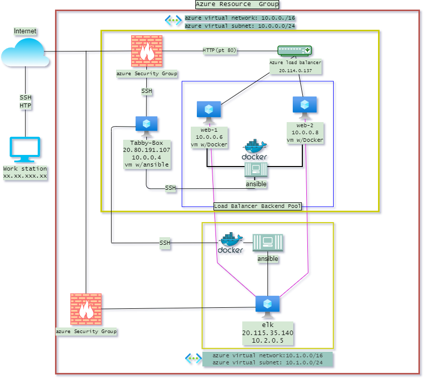
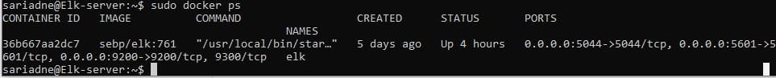

# Project1_Sub
repository for project 1
## Automated ELK Stack Deployment

The files in this repository were used to configure the network depicted below.

These files have been tested and used to generate a live ELK deployment on Azure. They can be used to either recreate the entire deployment pictured above. Alternatively, select portions of the yaml file may be used to install only certain pieces of it, such as Filebeat.

  - [install-elk](Ansible/install-elk.yml)
  - [ansible configuration](Ansible/ansible.cfg)
  - [hosts](Ansible/hosts.txt)

This document contains the following details:
- Description of the Topology
- Access Policies
- ELK Configuration
  - Beats in Use
  - Machines Being Monitored
- How to Use the Ansible Build

### Description of the Topology

The main purpose of this network is to expose a load-balanced and monitored instance of DVWA, the D*mn Vulnerable Web Application.

- Load balancing ensures that the application will be highly available, in addition to restricting access to the network. Load Balancing plays an important security role as to increase availability through distributing data and shifts traffic from main server to a cloud provider.
- The advantage of a jump box is that allows administrators to acces multiple systems and provides additional layer between the main server and gateway to connect to other servers or untrusted enviroments.

Integrating an ELK server allows users to easily monitor the vulnerable VMs for changes to the event logs and system metrics.
- Filebeat monitors the log files and directories or locations that is specified and collects the log events.
- Metricbeat collects metrics from the systen and services running and statistics from the servers and ships them to the output that is specified.

The configuration details of each machine may be found below.

| Name       | Function   | IP address              | Operating System |
|------------|------------|-------------------------|:----------------:|
| Jump Box   | Gateway    | 20.80.191.107/ 10.0.0.4 | Linux            |
| Web-1      | Web server | 10.0.0.6                | Linux            |
| web2       | Web server | 10.0.0.8                | Linux            |
| Elk-server | Monitoring | 10.2.0.5                | Linux            |

### Access Policies

The machines on the internal network are not exposed to the public Internet. 

Only the Jum box  machine can accept connections from the Internet. Access to this machine is only allowed from the following IP addresses:
- 20.80.191.107

Machines within the network can only be accessed by the Jump Box virtual Machine.
- The Jump Box VM has access to the ELK VM. The IP address to the Elk-server Virtual machine is 20.115.35.140

A summary of the access policies in place can be found in the table below.

| Name       | Publicly Accesible  | IP address             |
|------------|---------------------|------------------------|
| Jump Box   | Yes                 | 20.80.191.107/10.0.0.4 |
| Web-1      | No                  | 10.0.0.6               |
| web2       | No                  | 10.0.0.8               |
| Elk-server | No                  | 20.115.35.140/10.2.0.5 |

### Elk Configuration

Ansible was used to automate configuration of the ELK machine. No configuration was performed manually, which is advantageous because it proved a stable enviroment and allows to configure difficult manual ataskts that become repetable ans makes it less vulerable to human error. 

The playbook [install-elk](Ansible/install-elk.yml) implements the following tasks:
- Give max number of memory map area of 262144.
- Installs: 
    - docker.io 
    - pip3
    - docker module
- download and launch elk with published ports:
    - 5601
    - 9200
    - 5044

The following screenshot displays the result of running `docker ps` after successfully configuring the ELK instance.

### Target Machines & Beats
This ELK server is configured to monitor the following machines:
  - Web-1 10.0.0.6
  - web2 10.0.0.8

We have installed the following Beats on these machines:
- [Filebeat](Ansible/filebeat-playbook.yml) and [Metricbeat](Ansible/matricbeat-playbook.yml)

These Beats allow us to collect the following information from each machine and forwars to Logstash and Elasticsearch for indexing:
- Filebeat forwars and centralizes log data. Installed as an agent on the servers, Filebeat monitors the log files or locations that is specified, collects log events. To sum it up Filebeat collects data about the file system. For example Filebeat collects audit logs it is only designed to collect log files from specific files like those generated by apache.
- Metricbeat  periodically collects metrics from the operating system and from services running on the server. For metric beat you would expect to see files such as system.syslog or up time.

### Using the Playbook
In order to use the playbook, you will need to have an Ansible control node already configured. Assuming you have such a control node provisioned: 

SSH into the control node and follow the steps below:
- Copy the filebeat-config.yml file to /etc/ansible/files directory.
- Update the /etc/ansible/hosts file to include the IP addres of both web servers and the elk server to be able to specify what hosts are being configures with a playbook.[hosts](Ansible/hosts.txt) specift wich servers belong to what hosts. Example:
  [elk]
  10.2.0.5 ansible_python_interpreter=/usr/bin/python3#alpha.example.org
- Run the playbook, and navigate to http://20.115.35.140:5601/app/kibana#/home  or http://[VM.IP]:5601/app/kibana to check that the installation worked as expected.

To run a playbook the following command will be used once hosts, config file and the playbook have been scripted.
example: 
- ansible-playbook install-elk.yml
